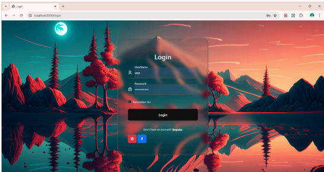
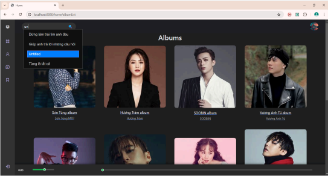
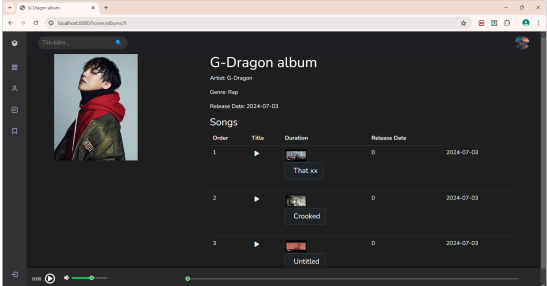
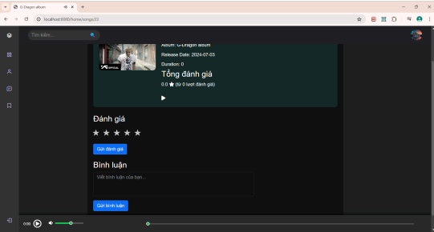
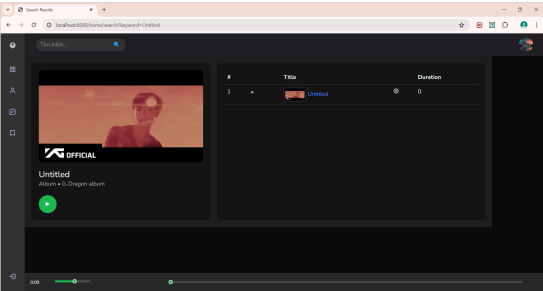
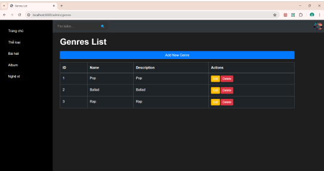

# MusicWebsite
Subject Project
Login page using oath2u for user can sign up by using facebook or google account

This is homepage have a singer, new song release or album filter for user to chooser or you can looking for the song you like base on searching bar using autocomplete.

And inside you can vote for the song you like or comment to discuss about the song or you can add the song into your playlist

And this is admin interface to manage website content and user.

